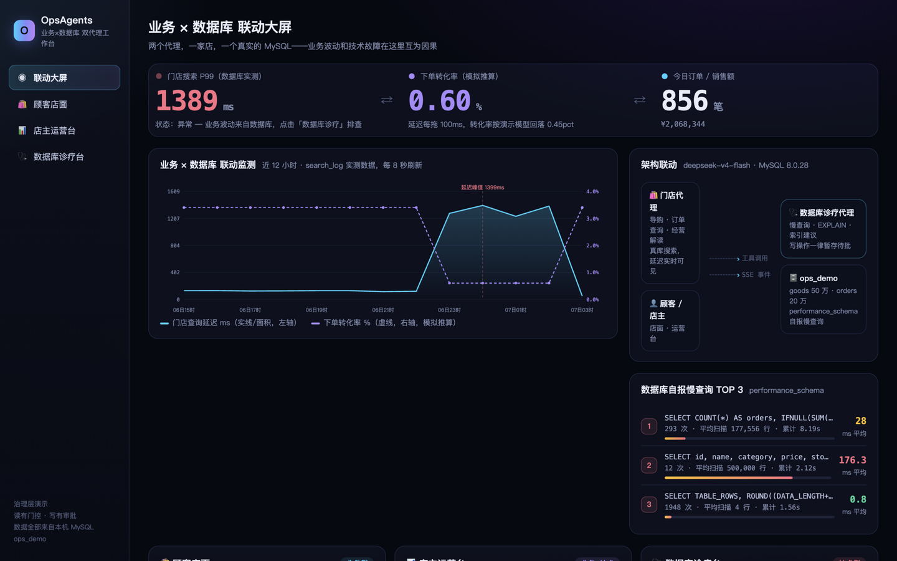
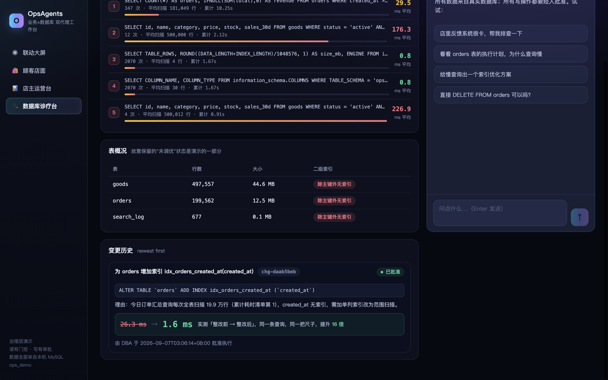

# OpsAgents · 业务×数据库 双代理工作台

<p align="center">
  
</p>

**一个演示「AI 智能体如何被治理地接入生产系统」的开源参考实现。** 两个代理共享同一家"店"（同一个真实 MySQL）：

- **门店代理（commerce）**：导购、订单查询、经营解读——业务侧的每一次搜索延迟都当场可见；
- **数据库诊疗代理（mysql）**：慢查询榜、执行计划树、实测耗时、索引建议——技术侧诊断同一个库。

业务波动与技术故障在这里**互为因果**：店面搜索变慢 → 运营代理指出转化率回落指向数据库 → 数据库代理定位全表扫描 → 提出索引变更（**暂存**）→ DBA 在控制台**批准** → 真实执行 DDL → 实测延迟 **26.3ms → 1.6ms（16 倍）**，业务指标回归。

<p align="center">
  
</p>


## 治理层（ops_common）

| 机制 | 位置 | 说明 |
|---|---|---|
| SQL 读门控 | `verticals/mysql/gates.py` | 仅单条 SELECT；禁 DML/DDL 关键字；禁跨库表；去注释防注入 |
| 来源门控 | `verticals/mysql/tools.py` | 实测耗时只接受本会话诊断工具给出过的 SQL；暂存索引必须先诊断过该表 |
| 暂存 + 审批 | `ops_common/changes.py` | 代理唯一的写路径是 `stage_*`；`apply` 只认宿主审批路由的标记，聊天里说"同意"无效 |
| 护栏 | `gates.IndexGuardrails` | 暂存时 + 应用时双重校验：白名单表、列存在、重复索引、行数上限、SQL 与登记一致 |
| 围栏 | `ops_common/fencing.py` | 第三方文本（样例 SQL、表结构）净化后加围栏再进模型 |
| 错误隔离 | `ops_common/turn.py` | 工具异常不终结回合；被拦截返回 blocked 状态与门控名 |

模型无关：任何 Anthropic 兼容端点皆可（演示配置为 DeepSeek `deepseek-v4-flash`，见 `.env`）。

## 快速开始

前置：Python 3.11+、Node 18+、本机 MySQL 8.0（账号写在 `.env`，需要 CREATE/ALTER/INDEX 权限）。

```bash
cp .env.example .env     # 填 MySQL 与模型 API Key
./run.sh                 # 首次自动播种演示库（约 10 秒）并启动
open http://localhost:8800
```

四个页面：联动大屏 / 顾客店面 / 店主运营台 / 数据库诊疗台。

## 演示剧本（约 5 分钟）

1. **大屏**：指出延迟-转化率两条线的联动（search_log 实测数据）；
2. **店面**：搜"帐篷"，看搜索耗时徽章；点"查询我的订单"——20 万行全表扫描，延迟上榜；
3. **数据库诊疗台**：让代理"排查系统为什么卡"——它读 PFS 慢查询榜 → 看表结构 → EXPLAIN（全表扫描红标）→ 实测基线 → **暂存**索引变更；
4. **批准**：回到待审批卡片点「批准执行」——真实 ALTER TABLE，卡片自动给出整改前后实测对比；
5. **回到大屏/运营台**：延迟回落、转化率恢复——业务指标与技术修复闭环。

重置演示状态：`python seed.py`（会清掉已加的索引，恢复"未调优"状态）。

## 仓库结构

```
ops_common/            治理层：门控/暂存审批/围栏/技能/回合循环
verticals/mysql/       数据库诊疗代理（backend/gates/tools/skills）
verticals/commerce/    门店代理（backend/tools/skills）
server/app.py          FastAPI：SSE 对话、审批路由、概览接口、静态控制台
web/                   控制台（Vite + React + TS，深色任务控制台风格）
seed.py                演示库播种（500k goods + 200k orders + search_log）
```

## 边界声明

演示代码：无鉴权（仅监听 localhost）、转化率为声明的模拟推算、护栏数值为演示值。生产使用需补：鉴权、审计、备份、慢查询阈值策略、审批权限体系。

许可：Apache-2.0。架构模式参考 anthropics/commerce-agents（暂存审批、来源门控、服务端 UI 校验），全部代码为本项目原创实现。
