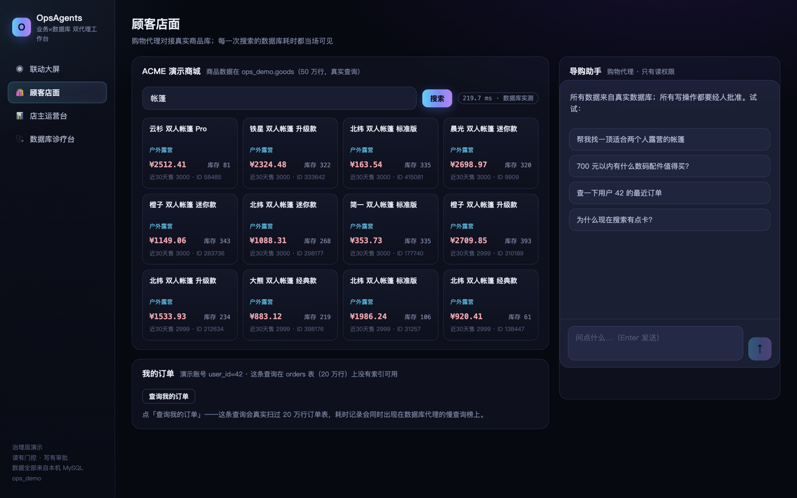
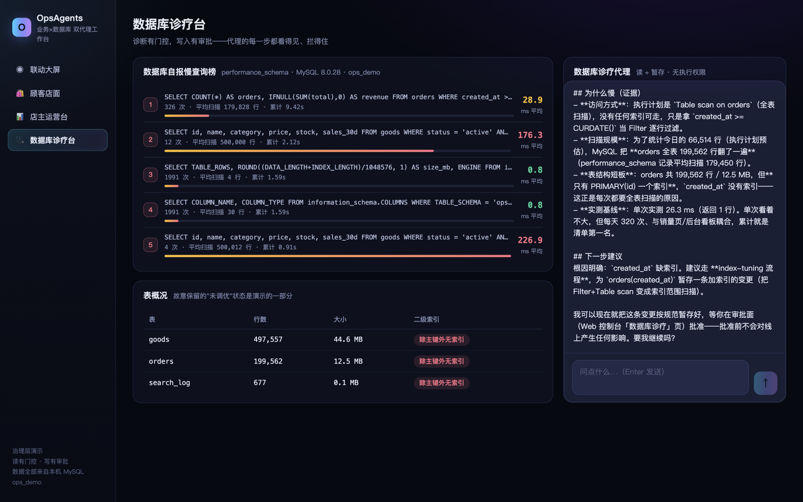
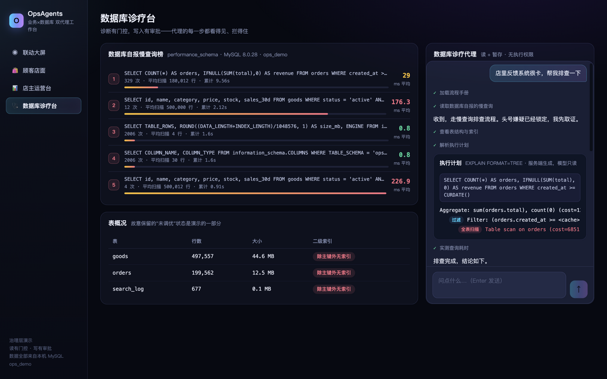
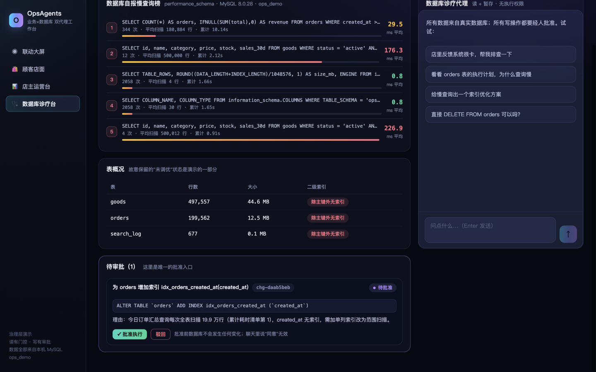

# OpsAgents 发布文章（微信公众号 / GitHub 通用稿）

> 发布说明（投稿前删除本段）：文中截图位于 `docs/images/`，公众号排版时按编号插入对应位置；所有数字均来自本地实测演示，不包含任何密钥、账号或内网信息。

---

# 我们让 AI 代理给生产数据库提索引建议：暂存、审批、实测 26.3ms → 1.6ms


**这不是一张概念图。** 图上每一个数字都来自一台真实运行的 MySQL：50 万行商品表、20 万行订单表、performance_schema 自报的慢查询、每一条被实测计时的 SQL。

它是我们开源项目 **OpsAgents** 的运行画面——两个 AI 代理共享同一家"店"：**门店代理**在业务侧导购、查订单、解读经营；**数据库诊疗代理**在技术侧找慢查询、读执行计划、提出索引建议。

今天它完成了一次完整的自我修复，全程无一行人工 SQL：

> 诊断（全表扫描 199,562 行，实测 26.3ms）→ 暂存索引变更 → DBA 点「批准」→ 真实执行 DDL → 复测 **1.6ms，提升 16 倍**。

下面把这次修复完整拆给你看——以及它背后那套让 AI 敢碰生产系统的治理层。

## 一、AI 代理上不了生产的三个缺口

市面上的 Agent 演示很多，能进生产 grafana 视野的很少，因为绝大多数演示止步于"能聊"。真要接上生产系统，缺的是三样东西：

| 缺口 | 后果 | OpsAgents 的答案 |
|---|---|---|
| **幻觉** | 模型编造表名、编造指标，照样说得头头是道 | 来源门控：写操作只认本会话工具真实返回过的对象 |
| **写操作** | 一句"帮我优化一下"就直接 DDL，出了事无法追责 | 暂存-审批：代理唯一的写路径是提交"建议卡片"，批准按钮在人手里 |
| **黑盒** | 用户不知道 AI 干了什么、花了多少、为什么这么做 | 全程可视：每一步工具调用、每次拦截、每条耗时都上屏 |

这三个答案都活在普通代码里，不依赖任何特定模型——我们用国产模型（DeepSeek，走 Anthropic 兼容协议）跑通了全部流程，换模型不改治理层。

## 二、一次完整的自愈，六步拆解

### 1️⃣ 业务侧先"感到了疼"



顾客在店面搜"帐篷"。搜索框旁边那个徽章不是装饰——**219.7ms，是这条查询在 50 万行商品表上的真实耗时**，每一次搜索都会被计时并写入数据库。业务侧的疼，从第一毫秒起就有记录。

### 2️⃣ 数据库代理开始诊断，每一步可见



在诊疗台点一句"店里反馈系统很卡"，代理开始工作。注意右侧回答里没有一个编造的数字：

- 访问方式：执行计划是 **Table scan on orders（全表扫描）**，没有任何索引可用；
- 数据扫描量：本日只统计了当天，MySQL 却把 **orders 全表 199,562 行翻了一遍**；
- 表结构短板：orders 共 199,562 行 / 12.5 MB，但只有 PRIMARY(id)——这正是每次全表扫描的原因；
- 实测基线：单次实测 **26.3 ms**。单次看着不大，但每天 320 次，累计就是清单第一名。

### 3️⃣ 执行计划不是文本，是"服务端渲染的卡片"



放大看聊天流：左边一列 ✓ 是代理调用的每个工具（加载流程手册 → 读慢查询 → 表结构 → 执行计划 → 实测耗时），中间那张**执行计划树卡片，是服务端生成、模型只读的**——代理负责"点菜"，系统负责把 `EXPLAIN FORMAT=TREE` 渲染成带"全表扫描"红色徽章的可视化树。

模型可以娓娓道来，但证据永远由数据库亲自出具。

### 4️⃣ 建议 ≠ 执行：暂存卡片是唯一的写路径



代理给出的索引建议，以一张**暂存变更卡**的形式落在审批面板：SQL 原文、变更理由、影响对象，以及那行关键提示——

> **批准前数据库不会发生任何变化；聊天里说"同意"无效。**

代理没有执行权限，连承诺"马上生效"都被提示词禁止。这不是聊天机器人自觉，是 `apply` 接口只认审批路由的标记——代码层面写死的。

### 5️⃣ 人点批准，系统交出"同一把尺子"的前后对比


DBA 点下「批准执行」，真实的 `ALTER TABLE` 才会发生。变更卡随即更新为：

> ~~26.3 ms~~ → **1.6 ms**，同一条查询，同一把尺子，**提升 16 倍**。

整改前后的耗时都用同一个 `measure` 工具实测，不接受任何"理论上快了多少"。

### 6️⃣ 业务指标回归，闭环合上

回到大屏：随着索引生效、慢查询消化，延迟曲线回落，转化率曲线抬头。业务和技术在同一个 dashboard 上互为因果——这就是我们把两个代理接在**同一个真实数据库**上的原因：不是两个演示，是一个系统的两层神经。

## 三、治理层四原则（给要造同类系统的人）

```
ops_common/
├── turn.py      回合循环：流式、工具分发、错误不终结回合
├── changes.py   暂存变更存储：apply 只认宿主审批路由的标记
├── fencing.py   围栏：第三方文本净化后加标签进入模型
├── skills.py    技能注册：流程手册按需加载
└── tools.py     工具契约：门控与处理器绑定
verticals/mysql/
├── gates.py     SQL 读门控 + 索引护栏（暂存时、应用时双重校验）
└── tools.py     来源阶梯：宽松读 → 计时要来源 → 写必须暂存
```

1. **读可以宽，写必须窄。** 只读 SELECT 只做语句级检查（单条、无 DML/DDL 关键字、白名单表）；而"实测某条 SQL"要求它来自本会话诊断工具的输出，"提交索引变更"要求该表被诊断过——权限越敏感，来源要求越严。
2. **护栏跑两次。** 暂存时校验一次（表白名单、列存在、重复索引、行数上限），应用时再校验一次——配置可能在两次之间被人改过。
3. **证据由系统出具，模型只负责解读。** 计划树、耗时、行数全部来自工具结果；工具没给的数字，模型被要求明说"没有"。
4. **错误是事件，不是事故。** 工具抛异常返回错误结果、回合继续；被门控拦截返回 blocked 状态与门控名字——用户永远知道发生了什么。

一次真实的插曲：调试中工具连续报错，代理在重试三次后主动停止，回复"我没有证据……直接去解释就是瞎猜，违反红线"——错误隔离加上约束提示词，AI 的失控行为被降级成了一条可读的状态。

## 四、5 分钟跑起来

前置：Python 3.11+、Node 18+、本机 MySQL 8.0（账号需 CREATE/ALTER/INDEX 权限）。

```bash
git clone <repo-url> && cd ops-agents
cp .env.example .env        # 填 MySQL 账号与模型 API Key
./run.sh                    # 首次自动播种演示库（约 10 秒）并启动
open http://localhost:8800
```

演示库 `ops_demo` 完全独立：goods 50 万行、orders 20 万行、刻意不建二级索引、search_log 实时记录每条查询耗时。想重来一遍：`python seed.py`，8 秒重置回"未调优"状态。

- **四个页面**：联动大屏（业务×技术监测）、顾客店面（真实搜索+延迟徽章）、店主运营台（延迟归因）、数据库诊疗台（诊断+审批）。
- **模型无关**：任何 Anthropic 兼容端点均可；演示配置为 DeepSeek，切换模型零代码改动。
- **技能即流程**：每个代理的 SOP 是目录里的 SKILL.md，改流程不改代码。

## 五、定位与路线图

OpsAgents 不是又一个 Agent 框架——运行时很薄，模型随便换。它是一份**"AI 碰生产系统"的治理参考实现**：

- ✅ 已有：SQL 读门控、来源阶梯、暂存-审批、双重护栏、服务端 UI 校验、技能化流程
- 🔜 计划中：审批权限体系、更多垂直（K8s 运维、日志诊断）、代理间委托（A2A）、评测集
- 💡 你也可以只读 `ops_common/` 那 800 行治理代码，把模式搬进你自己的项目

仓库与文档见文末链接。如果这套"暂存-审批"的思路对你有启发，欢迎 Star 与交流。

---

**OpsAgents** · Apache-2.0 · 数据与品牌均为演示虚构
GitHub：https://github.com/yueyezhufeng/chat-data ｜ 治理层详解见仓库 README 与 `docs/`
